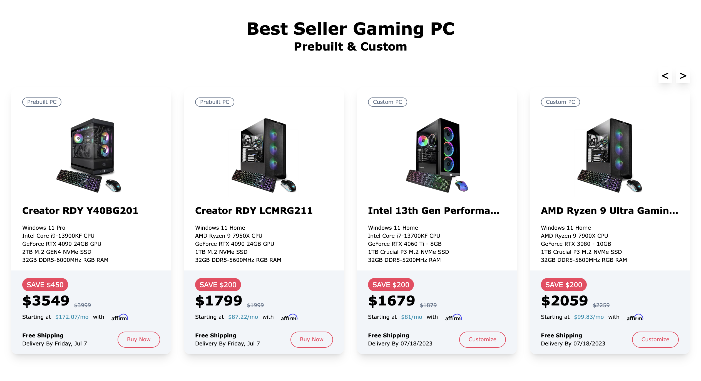
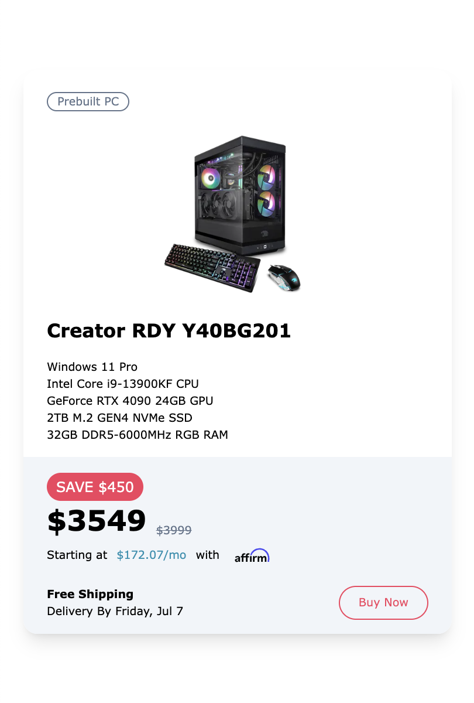

# Gaming PC app

This is a project display gaming PC with swipe page feature
 

## Table of contents

- [Overview](#overview)
  - [Feature](#feature)
  - [Screenshot](#screenshot)
  - [Links](#links)
- [My process](#my-process)
  - [Built with](#built-with)
  - [What I learned](#what-i-learned)
  - [Continued development](#continued-development)
  - [Useful resources](#useful-resources)
- [Author](#author)
- [Acknowledgments](#acknowledgments)

## Overview

### Feature

- Display gaming pc card with RWD
- Switch page with swipe gesture

### Screenshot

Desktop mode:
 

Mobile mode:
 

### Links

- Live Site URL: [https://gaming-pc-efx4o22ao-ching0810s-projects.vercel.app/](https://gaming-pc-efx4o22ao-ching0810s-projects.vercel.app/)

## My process

### Built with

- [React](https://reactjs.org/) - framework
- [Next.js](https://nextjs.org/) - React framework
- [Typescript](https://www.typescriptlang.org/) - syntax for types
- [TailwindCSS](https://tailwindcss.com/) - CSS framework
- [Hammerjs](https://hammerjs.github.io/) - Gesture detect library
- Mobile-first workflow

## What I learned

- How to build Next.js project with tailwind CSS
- How to detect gesture like swipe as trigger event

## Continued development

- Component refactoring
- Gesture detect efficiency

## Useful resources

- [Next.js tutorial](https://www.youtube.com/watch?v=ZVnjOPwW4ZA&t=1417s) - tutorial for basic Next.js concept and simple project demonstration
- [Tailwind CSS official document](https://tailwindcss.com/) - reference for tailwind css, setting and customization
- [Hammer.js](https://hammerjs.github.io/) - official document for hammerjs library, which could detect different gesture including swipe, drag...etc

## Author

- Ching0810 - [https://github.com/Ching0810](https://github.com/Ching0810)

## Acknowledgments

Currently none
